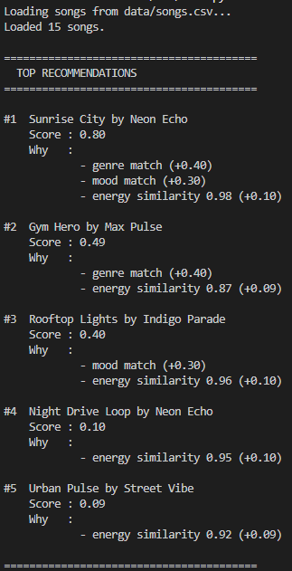
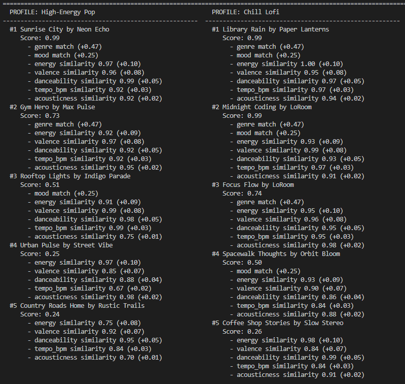
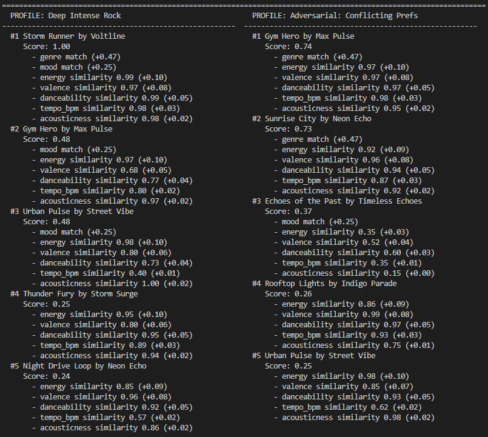
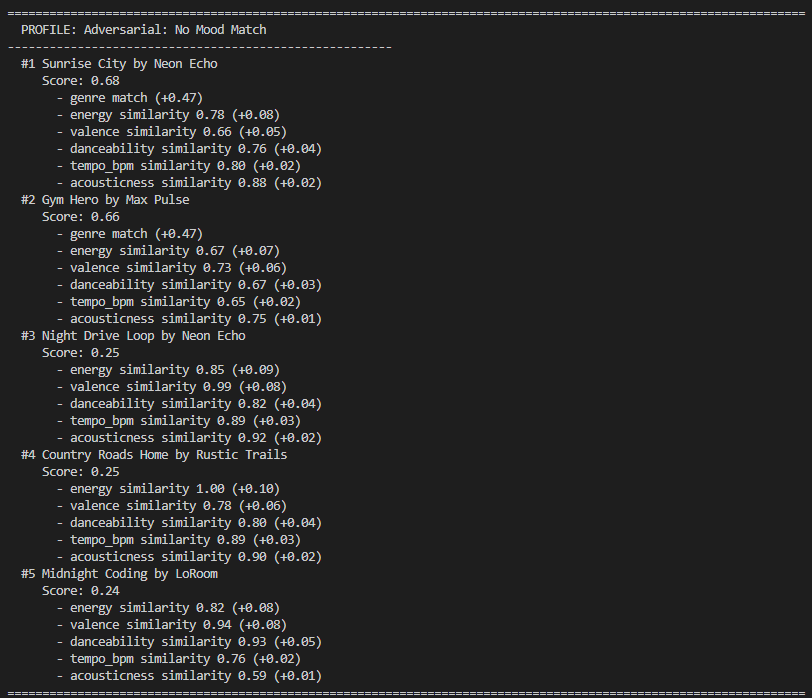

# 🎵 Music Recommender Simulation

## Project Summary

In this project you will build and explain a small music recommender system.

Your goal is to:

- Represent songs and a user "taste profile" as data
- Design a scoring rule that turns that data into recommendations
- Evaluate what your system gets right and wrong
- Reflect on how this mirrors real world AI recommenders

Replace this paragraph with your own summary of what your version does.

---

## How The System Works

This system recommends songs by comparing each song to a user’s music taste profile.

Each `Song` has features such as **genre, mood, energy, valence, danceability, tempo_bpm, and acousticness**. These features describe both the style and feel of the song.

The system builds a `UserProfile` using multiple liked songs. This profile represents the user’s overall taste and is used as the reference point for all comparisons.

---

### Scoring System

Each song is given a score based on how similar it is to the `UserProfile`.

* Higher score = better match
* Total score = weighted sum (weights = 1.0)

---

### Categorical Features

These check for exact matches:

* Genre → 1 if match, else 0 (**weight 0.47**)
* Mood → 1 if match, else 0 (**weight 0.25**)

---

### Numerical Features

These measure how close values are using:

`similarity = 1 - |target - value| / range`

* Energy → weight 0.10
* Valence → weight 0.08
* Danceability → weight 0.05
* Tempo (BPM) → weight 0.03 (range ≈ 92)
* Acousticness → weight 0.02

---

### Output

All songs are scored and sorted from highest to lowest.
The system recommends the top-scoring songs.


## UserProfile Class

Represents the user’s overall taste based on multiple liked songs.

### Attributes

* genre → most common genre (mode)
* mood → most common mood (mode)
* energy → average
* valence → average
* danceability → average
* tempo_bpm → average
* acousticness → average

### Purpose

* Acts as the reference for scoring
* Combines multiple liked songs into one profile
* Makes recommendations more accurate and stable

## Song Class

Represents a single song to evaluate.

### Attributes

* genre
* mood
* energy
* valence
* danceability
* tempo_bpm
* acousticness

### Purpose

* Compared against the `UserProfile`
* Used to calculate similarity score
* Ranked based on how well it matches the profile


## Potential Biases

* May **over-prioritize genre**, causing good matches in other genres to be ranked lower
* Uses **exact mood matching**, which can ignore songs with similar vibes but different labels
* Averaging in the `UserProfile` may **wash out unique or diverse preferences**
* Relies on dataset labels, so **incorrect genre/mood tags can hurt recommendations**

---










## Getting Started

### Setup

1. Create a virtual environment (optional but recommended):

   ```bash
   python -m venv .venv
   source .venv/bin/activate      # Mac or Linux
   .venv\Scripts\activate         # Windows

2. Install dependencies

```bash
pip install -r requirements.txt
```

3. Run the app:

```bash
python -m src.main
```

### Running Tests

Run the starter tests with:

```bash
pytest
```

You can add more tests in `tests/test_recommender.py`.

---

## Experiments You Tried

Use this section to document the experiments you ran. For example:

- What happened when you changed the weight on genre from 2.0 to 0.5
- What happened when you added tempo or valence to the score
- How did your system behave for different types of users

---

## Limitations and Risks

Summarize some limitations of your recommender.

Examples:

- It only works on a tiny catalog
- It does not understand lyrics or language
- It might over favor one genre or mood

You will go deeper on this in your model card.

---

## Reflection

Read and complete `model_card.md`:

[**Model Card**](model_card.md)

Write 1 to 2 paragraphs here about what you learned:

- about how recommenders turn data into predictions
- about where bias or unfairness could show up in systems like this

I learned that recommender systems take data and turn it into predictions by comparing similarities and patterns. I used to think you need a complex AI with advanced math to create recommendation systems like the ones found in Spotify but was surpised that you can actually use simple math such as weighted scoring and similiarity calculations to create similar systems. I also learned that bias can easily show up in these systems. For example, in my recommender, I made it so genre and mood were heavily weighted so the system was biased in recommending songs similar in those categories, which limit diversity and exploration in recommendations and affects what the user sees. I used AI to help me with brainstorming ideas on how I should build my recommender and how it should score. I did have to double check the responses AI gave and also gave my own opinions to try to fine tune the model. If I were to extend this project, I would add a frontend UI for the user to easily interact with it.

---

## 7. `model_card_template.md`

Combines reflection and model card framing from the Module 3 guidance. :contentReference[oaicite:2]{index=2}  

```markdown
# 🎧 Model Card: Music Recommender Simulation

## 1. Model Name  

Give your model a short, descriptive name.  
Example: **VibeFinder 1.0**

FibeVinder 1.3

---

## 2. Intended Use  

Describe what your recommender is designed to do and who it is for. 

Prompts:  

- What kind of recommendations does it generate  
- What assumptions does it make about the user  
- Is this for real users or classroom exploration  

This tool is designed to recommend songs to users by comparing their music preferences to songs in a database and ranking them by closest to least match based on genre, mood, energy, tempo, etc. It returns the top 5 most recommended songs and explain the decision making behind its score. It assumes it can replicate a user's taste of music through numbers. It's designed for classroom exploration.

---

## 3. How the Model Works  

Explain your scoring approach in simple language.  

Prompts:  

- What features of each song are used (genre, energy, mood, etc.)  
- What user preferences are considered  
- How does the model turn those into a score  
- What changes did you make from the starter logic  

Avoid code here. Pretend you are explaining the idea to a friend who does not program.

Model scores each song by comparing tags such as genre, mood, energy, tempo, etc. to the user's preferences. The model considers genre, mood, valence, danceability, tempo, acousticness in that order when determining score. Genre and mood affect the score the most. This means the model prioritizes genre the most when determining whether to recomend a song while the other tags help fine tune the ranking. Comapred to the starter logic, the model uses weights so that max score is 1, while the starter logic adds points (over 1) if a song matches in genre and mood. 

---

## 4. Data  

Describe the dataset the model uses.  

Prompts:  

- How many songs are in the catalog  
- What genres or moods are represented  
- Did you add or remove data  
- Are there parts of musical taste missing in the dataset  

15 songs are in the catalog. Genres such as pop, lofi, rock, hip hop, jazz, classical, etc. and moods such as happy chill, intense, sad, etc. I added the last 5 songs in songs.csv. Because the data set is small, there are some genres, moods, and other preferences that are missing.

---

## 5. Strengths  

Where does your system seem to work well  

Prompts:  

- User types for which it gives reasonable results  
- Any patterns you think your scoring captures correctly  
- Cases where the recommendations matched your intuition  

Works well with users with clear and consistent preferences and those that want a specific genre and mood. I personally feel that it captures most user's well because most people identify the type of music they listen to based on genre. Eventually when they go through all the songs that match genre which they will most likely enjoy, then the system begins to recommend songs outside of their comfort zone while keeping in mind their other preferences. The recommendations matched my intuition in cases like the high-energy pop and chill lofi profiles, where the top songs were obvious choices that clearly fit the desired genre and vibe.

---

## 6. Limitations and Bias 

Where the system struggles or behaves unfairly. 

Prompts:  

- Features it does not consider  
- Genres or moods that are underrepresented  
- Cases where the system overfits to one preference  
- Ways the scoring might unintentionally favor some users  

System unfairly favors songs that match the user profile's genre due to its high weighting. This prioritizes the genre over other factors. As a result, songs with different genres that still match the user's vibe will be ranked lower and overlooked, which might prevent exploration of new songs.

---

## 7. Evaluation  

How you checked whether the recommender behaved as expected. 

Prompts:  

- Which user profiles you tested  
- What you looked for in the recommendations  
- What surprised you  
- Any simple tests or comparisons you ran  

No need for numeric metrics unless you created some.

I tested the recommender using multiple user profiles such as high-energy pop, chill lofi, deep intense rock, and some edge cases like conflicting preferences and no mood match. I looked for whether the top recommendations matched the intended genre and overall vibe, and whether similar songs ranked higher than less relevant ones. Not much suprised me.

---

## 8. Future Work  

Ideas for how you would improve the model next.  

Prompts:  

- Additional features or preferences  
- Better ways to explain recommendations  
- Improving diversity among the top results  
- Handling more complex user tastes  

In the future, I would hope to improve the model by adding more tags such as lyrics and also add features such as recommmending similar artists. I would also want to imporve the explanations by also including a short paragraph that sumarizes what all the numbers mean. I would also add a feature that would just skip tags like genre as a "exploration mode" if the user wants to be daring and explore stuff outside their normal genre. (exclude tags) For more complex tastes, I would add a feature that scores reccomendations based on multiple listening profiles as people might have varying music tastes based on genre.

---

## 9. Personal Reflection  

A few sentences about your experience.  

Prompts:  

- What you learned about recommender systems  
- Something unexpected or interesting you discovered  
- How this changed the way you think about music recommendation apps

I learned that recommender systems can be built using simple math (not require the use of an AI model which uses a ton of math). One thing that was interesting was how changing the weights would affect the rankings. This project gave me a greater appreciation for services like Spotify that are able to generate high quality recommendations.
